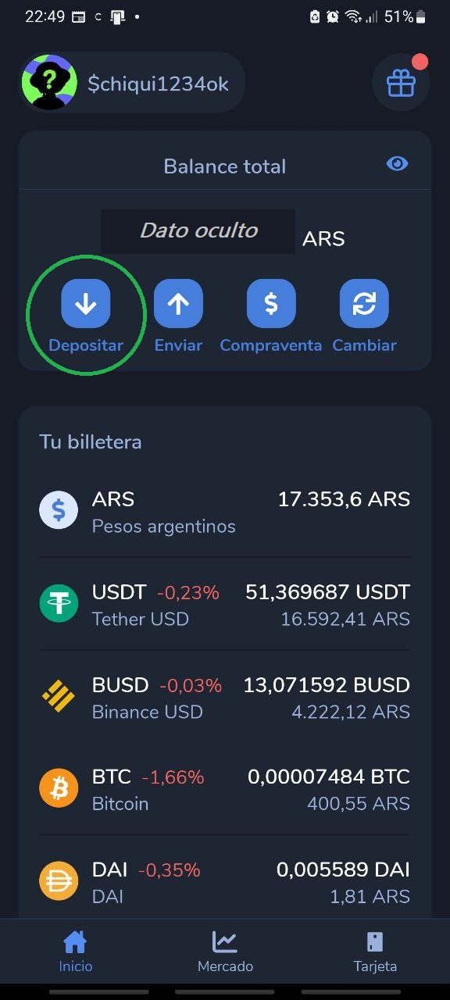
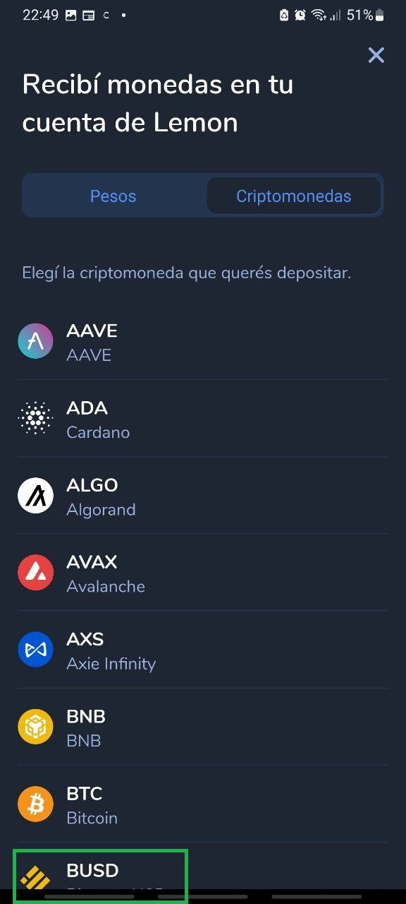
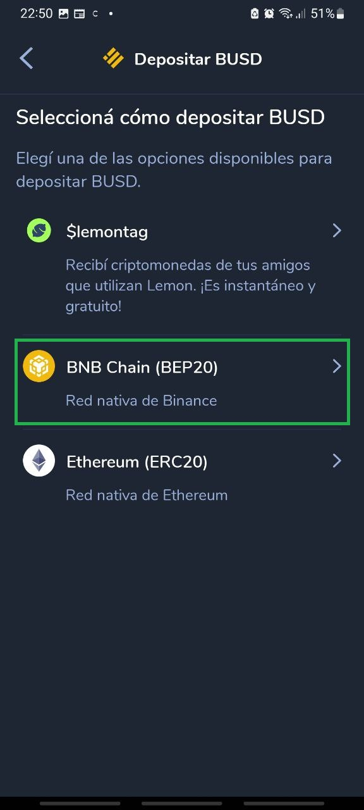
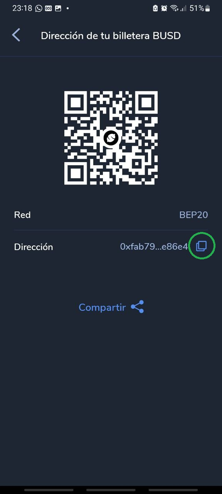

Una vez instalado **Lemon Cash** en tu dispositivo Android / iOS, registrado una cuenta con tu email, contraseña, foto del DNI, etc; podrás obtener la dirección para cobrar tus criptos.

## 1. Localizar el botón "Depositar"

Tocar el icono con la fecha, acompañado por el texto "Depositar".

## 2. Seleccionar la criptomoneda deseada

En este caso de ejemplo, podemos ir a la pestaña "Criptomonedas" (al lado de la palabra "Pesos") y luego, buscar la criptomoneda **BUSD**. 😁

## 3. Elegir la red

Este es el paso más importante, ya que redes distintas **no se comunican entre sí**. En este caso, elegimos la red BNB Chain (BEP20 / BSC). En otras aplicaciones se mostrará como "Binance Smart Chain", "BEP20" y/o "BSC". No confundir **BEP20** con *BEP2*, que **son redes distintas**.

## 4. Copiar la dirección/wallet

Acá simplemente debés copiar la dirección y ofrecerla a tu gestor Minermate para que pueda enviarte el dinero. Esta dirección es como un CBU/CVU convencional de cualquier banco o tarjeta prepaga (MercadoPago, Ualá, etc). ¡Te llega la plata en instantes y podés cambiarla por pesos! También, intercambiarla por otra cripto o mandarla a una billetera privada y más segura.

